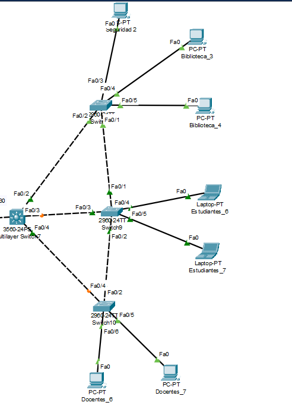

# Proyecto 1

## LAB REDES DE COMPUTADORAS 1
## G7

# Manual Tecnico
## Descripción del Proyecto

Diseñar y configurar una red de comunicaciones que
interconecte los centros de la Universidad de San Carlos de Guatemala (USAC). Se deberá de crear una topología de red utilizando Cisco Packet Tracer,
simulando la interconexión de los siguientes centros: Sede Central, Centro
Universitario de Nor Occidente (CUNOROC), Centro Universitario de Occidente
(CUNOC), Centro Universitario de Chimaltenango (CUNDECH), y el Centro
Universitario Metropolitano (CUM).
El proyecto incluye la segmentación de la red mediante la creación de VLANs para
distintas áreas de la universidad, como Estudiantes, Docentes, Biblioteca, y
Seguridad. Además, se implementará el ruteo inter-VLAN utilizando la técnica de
Router on a Stick y configurando interfaces virtuales. El estudiante también deberá
aplicar VLSM y FLSM para la asignación eficiente de direcciones IP, y configurar el
ruteo estático y dinámico para asegurar la conectividad entre los centros.

# Subneting de las diferentes direcciones Ip de cada Area 


Para poder realizar el subnetin de las diferentes redes se utilizo el metodo de VLSM el cual ayudo a optimizar las direcciones IP y aca abajo queda la tabla de las direcciones IP que se usaron de cada area
## CUNDECH
-----------------------------
 Subred 1 Vlan 44 Biblioteca |Subred 2 Vlan 14 Estudiantes 
-----------------------------
subred 2 Vlan 24 Docentes | subred 4 vlan 34 Seguridad
--------

 

 


## CUM
-----------------------------
 Subred 1 Vlan 44 Biblioteca |Subred 2 Vlan 14 Estudiantes 
-----------------------------
subred 2 Vlan 24 Docentes | subred 4 vlan 34 Seguridad
--------

 

 

## CUNOROC
-----------------------------
 Subred 1 Vlan 44 Biblioteca |Subred 2 Vlan 14 Estudiantes 
-----------------------------
subred 2 Vlan 24 Docentes | subred 4 vlan 34 Seguridad
--------

 

 

## CENTRAL
-----------------------------
 SERVER0 Vlan 54 | 192.120.0/24  |MASCARA 255.255.255.0 
-----------------------------
SERVER1 Vlan 64 | 192.121.0/24  |MASCARA 255.255.255.0 
--------
SERVER1 Vlan 74 | 192.122.0/24  |MASCARA 255.255.255.0 
--------
 

# BACKBONE
 


## Resumen de las IPs usadas en cada area

# Listado de IPs por Área

## CUNOROC

| Área        | Cantidad | Dirección IP      |
|-------------|----------|-------------------|
| Estudiante  | 3        | 192.148.7.130     |
| Docente     | 3        | 192.148.7.194     |
| Seguridad   | 3        | 192.148.7.226     |
| Biblioteca  | 1        | 192.148.7.2       |

## CUM

| Área        | Cantidad | Dirección IP      |
|-------------|----------|-------------------|
| Estudiantes | 5        | 192.158.7.135     |
| Docentes    | 5        | 192.158.7.198     |
| Seguridad   | 1        | 192.158.7.230     |
| Biblioteca  | 2        | 192.158.7.6       |

## Central

| Servidor   | Dirección IP      |
|------------|-------------------|
| Server0    | 192.120.7.3       |
| Server1    | 192.121.7.3       |
| Server2    | 192.122.7.3       |

## CUNDECH

| Área           | IP              | Gateway         |
|----------------|------------------|------------------|
| Seguridad 2    | 192.168.7.226    | 192.168.7.225    |
| Biblioteca 3   | 192.168.7.2      | 192.168.7.1      |
| Biblioteca 4   | 192.168.7.3      | 192.168.7.1      |
| Estudiantes 6  | 192.168.7.137    | 192.168.7.129    |
| Estudiantes 7  | 192.168.7.138    | 192.168.7.129    |
| Docentes 6     | 192.168.7.196    | 192.168.7.193    |
| Docentes 7     | 192.168.7.194    | 192.168.7.193    |

---

## CUNOC

| Área           | IP              | Gateway         |
|----------------|------------------|------------------|
| Docentes 1     | 172.16.7.168     | 172.16.7.129     |
| Docentes 2     | 172.16.7.169     | 172.16.7.129     |
| Seguridad 4    | 172.16.7.196     | 172.16.7.193     |
| Estudiantes 1  | 172.16.7.5       | 172.16.7.1       |
| Estudiantes 2  | 172.16.7.7       | 172.16.7.1       |


## COMANDOS USADOS PARA LA CONFIGURACION DE LOS DIFERENTES PROTOCOLOS A LOS SWICHES CAPA 2 Y 3 Y ROUTERS


## 🧭 Configuración del protocolo VTP

```bash
vtp mode server
vtp domain Grupo7
vtp password usac2025
```

## 🧾 Configuración de las VLANs

```bash
vlan 14
 name Estudiantes
vlan 24
 name Docentes
vlan 34
 name Seguridad
vlan 44
 name Biblioteca
```

## 🎚️ Modo acceso

```bash
interface fa0/1
 switchport mode access
 switchport access vlan 14
```

## 🌉 Modo trunk

```bash
interface gig0/1
 switchport mode trunk
 switchport trunk allowed vlan 14,24,34,44
```

## 🛣️ Configuración modo trunk para el router

```bash
interface gi0/1.14
 encapsulation dot1q 14
 ip address 192.148.7.1 255.255.255.192
```

## 🧯 Configuración HSRP para el área del CUM

```bash
interface gi0/0.14  
 encapsulation dot1Q 14
 ip address 192.158.7.130 255.255.255.192
 standby 14 ip 192.158.7.129
 standby 14 priority 100
 standby 14 preempt

interface gi0/0.24  
 encapsulation dot1Q 24
 ip address 192.158.7.130 255.255.255.192
 standby 24 ip 192.158.7.129
 standby 24 priority 100
 standby 24 preempt
```

## 📦 Configuración de PortChannel LACP (Switches centrales)

```bash
interface range fa0/1-3
 no switchport
 channel-group 1 mode active
exit

interface port-channel 1
 ip address 10.0.0.7 255.255.255.252
exit
```

## 🐙 Configuración OSPF para comunicación en el área central

```bash
router ospf 1
 network 192.158.7.0 0.0.0.123 area 0
```

## 🚀 Comandos Router 7

```bash
int se0/1/0
 ip address 10.0.0.74 255.255.255.252
 no shutdown

router rip
 version 2
 network 10.0.0.72
end

int se0/1/1
 ip address 10.0.0.78 255.255.255.252
 no shutdown

router rip
 version 2
 network 10.0.0.76
end

int gi0/0
 ip address 10.0.0.81 255.255.255.252
 no shutdown
```

## 🧮 Comandos Switch07 Multicapa

```bash
enable
conf t

int fa0/3
 switchport trunk encapsulation dot1q
 switchport mode trunk
 no shutdown

vtp domain Grupo07
vtp password usac2025
vtp mode client

ip routing

interface vlan 14
 ip address 192.168.7.129 255.255.255.192

interface vlan 24
 ip address 192.168.7.193 255.255.255.224

interface vlan 34
 ip address 192.168.7.225 255.255.255.248

interface vlan 44
 ip address 192.168.7.1 255.255.255.128

int fa0/1
 no switchport
 ip address 10.0.0.53 255.255.255.252

router eigrp 100
 network 192.168.7.128 0.0.0.63
 network 192.168.7.192 0.0.0.31
 network 192.168.7.224 0.0.0.7
 network 192.168.7.0 0.0.0.127
 network 10.0.0.52 0.0.0.3
 no auto-summary

spanning-tree vlan 14,24,34,44 priority 4096
```
## Configuración de las VLAN al Router

```bash
interface gi0/1.14
 encapsulation dot1q 54
 ip address 192.120.7.1
 ip route 0.0.0.0 0.0.0.0 10.0.0.49

Rutas estaticas
ip route 192.120.7.0 255.255.255.0 10.0.0.50
ip route 192.121.7.0 255.255.255.0 10.0.0.50
ip route 192.122.7.0 255.255.255.0 10.0.0.50

OSPF Redistribuidas
router ospf 1
 redistribute static subnets
